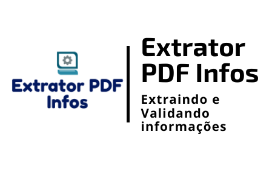

<h1 align="center">
    
</h1>

<h4 align="center"> 
	🚧 Extrator PDF Infos 1.0 🚀 em desenvolvimento... 🚧
</h4>

<p align="center">
  

  

  	
  <a href="https://www.linkedin.com/in/emerson-rafael/">
    
  </a>
	
  
  <a href="https://github.com/emersonrafaels/extract_text_infos/commits/main">
    
  </a>

  
   <a href="https://github.com/emersonrafaels/extract_text_infos/stargazers">
    
  </a>
</p>


## 💻 Sobre o projeto

📷 **Extrator PDF Infos** é um projeto que permite **Extrair** e **Validar**, informações contidas em **Textos**. A **validação** funciona através do envio de um **percentual de match desejado** entre um valor enviado e um valor obtido no texto.

Ex: Validação:

    nome_desejado = "Emerson V. Rafael"
    percentual_match_desejado = 82

	# O modelo retorna todos os nomes obtidos
	choices_list = ["Emerson Carlos", "Emerson Rafael", "Cleber de Castro", "emersona7x@hotmail.com"]

	# E o nome mais próximo do nome_desejado, acima do percentual de match desejado
	
	>>> "validator_name": true, 
		"name": [
			[
				"Emerson Rafael",
		         95
		    ]
		]

    
   No exemplo acima, o nome mais próximo do nome_desejado foi Emerson Rafael, com 95% de proximidade.

Atualmente o serviço está funcionando para:

 1. Input de uma string
 2. PDF Textual

## 🛠  Tecnologias

As seguintes ferramentas foram usadas na construção do projeto:

- [Python]

## 🚀 Como executar o projeto

1. **Instalando**: pip install -r requirements.txt
2. **Importando**: from main_extract_infos import Execute_Extract_Infos
3. **Executando**: Execute_Extract_Infos(json_input)

Ex: JSON Input:

```python
from main_extract_infos import Execute_Extract_Infos

# DEFININDO O JSON DE INPUT  
json_input = {}

# EXECUTANDO A CHAMADA DO SERVIÇO
model = Execute_Extract_Infos(json_input)
result = model.orchestra_extract()
```


## ➊ Pré-requisitos

Antes de começar, você vai precisar ter instalado em sua máquina as seguintes ferramentas (O download pode ser realizado pela própria página do Python ou Anaconda):
[Python](https://www.anaconda.com/products/individual).

## 💾 Informações obtidas
Extrator e validador de informações úteis em um texto.

| Informação        | Ações disponíveis 
| ------------- |:--------------------:|
| Nome| Extração e Validação  |
| CPF | Extração e Validação  |
| CNPJ| Extração e Validação  |
| Datas| Extração e Validação  |
| IMEI| Extração e Validação  |
| Localizações (LOC)| Extração e Validação  |
| Organizações (ORG)| Extração e Validação  |
| Páginas do arquivo PDF| Extração|

## [≝] Testes
Os testes estão na pasta: **TESTS/***.
Nela é possível verificar os testes disponíveis em arquivos individuais para cada um dos bancos de dados disponíveis.


## 📝 Licença

Este projeto está sob a licença MIT.

Feito com ❤️ por **Emerson Rafael** 👋🏽 [Entre em contato!](https://www.linkedin.com/in/emerson-rafael/)

[Python]: https://www.python.org/downloads/